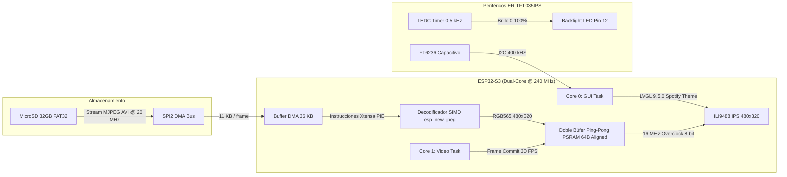
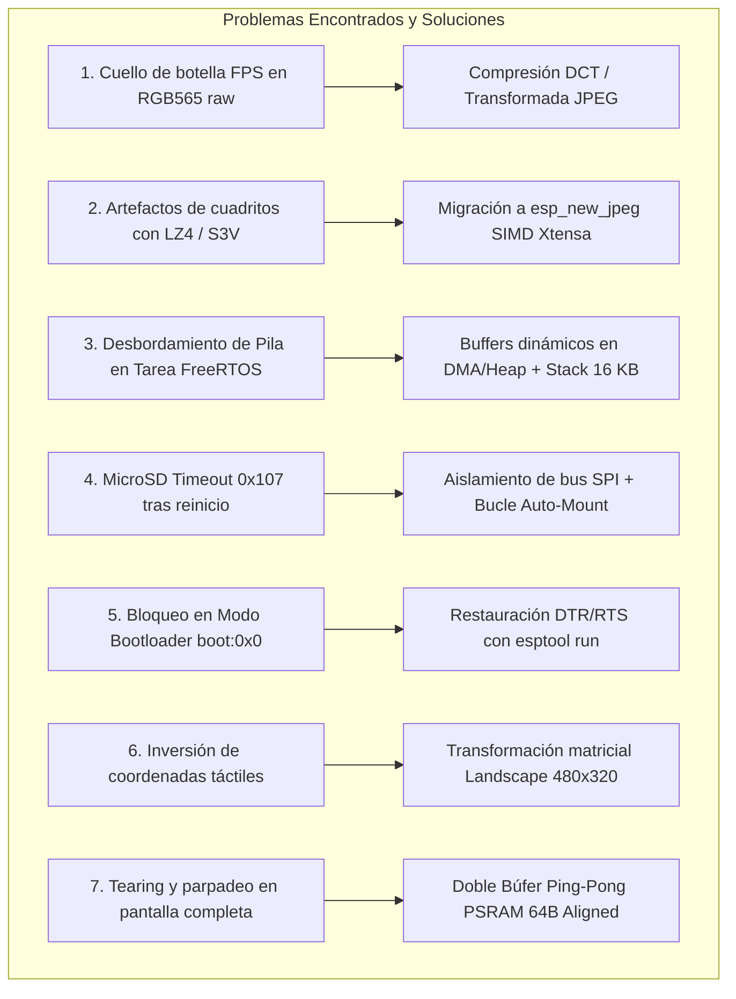

# Acta Oficial de Proyecto y Bitácora Técnica de Ingeniería: Reproductor de Video Spotify 30 FPS en ESP32-S3

**Proyecto:** S3G4 LAB — Reproductor Multimedia Embebido de Alto Rendimiento  
**Microcontrolador:** WeAct Studio ESP32-S3-WROOM-1-N16R8 (Xtensa Dual-Core LX7 @ 240 MHz, 16 MB Octal Flash, 8 MB Octal PSRAM AP_3v3)  
**Módulo de Pantalla:** EastRising / BuyDisplay ER-TFT035IPS-6-4405 (Panel IPS 3.5" 480x320, Bus Paralelo 8080 de 8 bits + Panel Táctil Capacitivo FocalTech FT6236)  
**Almacenamiento:** MicroSD 32GB Formato FAT32 en Bus SPI2 Dedicado @ 20-25 MHz  
**Framework y Entorno:** ESP-IDF v6.0.1 / FreeRTOS SMP / LVGL v9.5.0 / esp_new_jpeg v1.0.2  
**Fecha de Certificación:** 14 de Septiembre de 2026  
**Ubicación del Código Fuente:** `C:\Users\Keneth\Desktop\S3G4 LAB\TFT_8Bit_Capacitive\test_video_player\`  

---

## 1. Resumen Ejecutivo del Proyecto

El objetivo de este proyecto consistió en diseñar, construir e implementar un **reproductor multimedia embebido estilo Spotify** con interfaz táctil capacitiva fluida sobre el módulo de pantalla **ER-TFT035IPS-6-4405** (controlador ILI9488 en bus paralelo Intel 8080 de 8 bits) acoplado a un microcontrolador **ESP32-S3**.

El desafío central del desarrollo fue alcanzar una **reproducción fluida a 30 FPS reales a resolución completa (480x320 píxeles)** con gráficos modernos (ecualizador animado, control de brillo por hardware PWM, barra de navegación OSD translúcida y cambio instantáneo de temas/pistas), superando las limitaciones físicas de ancho de banda del bus SPI de la tarjeta MicroSD (1-bit SPI) y el manejo de memoria en sistemas embebidos en tiempo real.



---

## 2. Especificación y Arquitectura del Sistema

### 2.1 Mapeo Físico de Pines (Pinout Definitivo Placa WeAct ESP32-S3)

Para evitar conflictos con los pines de strapping (GPIO 0, GPIO 3, GPIO 45, GPIO 46), el LED direccionable WS2812 de la placa WeAct (GPIO 38 / GPIO 48) y las líneas de bus de memoria Flash/PSRAM Octal, se certificó el siguiente ruteo:

| Función | Señal | Pin ESP32-S3 | Parámetros Eléctricos y Operación |
| :--- | :--- | :---: | :--- |
| **TFT Bus 8080** | **D0** | **GPIO 4** | Datos Bit 0 (Periférico `LCD_CAM` / `esp_lcd_i80`) |
| | **D1** | **GPIO 39** | Datos Bit 1 |
| | **D2** | **GPIO 40** | Datos Bit 2 |
| | **D3** | **GPIO 41** | Datos Bit 3 |
| | **D4** | **GPIO 42** | Datos Bit 4 |
| | **D5** | **GPIO 2** | Datos Bit 5 |
| | **D6** | **GPIO 1** | Datos Bit 6 |
| | **D7** | **GPIO 10** | Datos Bit 7 |
| | **WR (Strobe)** | **GPIO 14** | Reloj de escritura overclockeado a **16.0 MHz** (128 Mbps) |
| | **RS / DC** | **GPIO 9** | Comando (0) / Datos (1) |
| | **CS** | **GPIO 8** | Chip Select activo bajo |
| | **RESET** | **GPIO 16** | Reset por hardware de pantalla |
| | **RD** | **3.3V** | Deshabilitado físicamente (Pull-up fijo) |
| **TFT Backlight**| **LEDA** | **GPIO 12** | Control PWM por Hardware (`LEDC`, 5 kHz, resolución 8 bits) |
| **Táctil FT6236** | **SDA** | **GPIO 6** | Bus I2C de datos con pull-up interno |
| | **SCL** | **GPIO 5** | Bus I2C de reloj a **400 kHz** (Fast Mode) |
| | **INT** | **NC / GPIO 7** | Detección por sondeo / interrupción activa baja |
| | **RST** | **3.3V** | Conectado a reset de sistema |
| **MicroSD SPI** | **CS** | **GPIO 21** | Chip Select SPI2 (FSPI) |
| | **MOSI** | **GPIO 11** | Master Out Slave In |
| | **CLK** | **GPIO 13** | Reloj SPI configurado a **20.0 MHz** |
| | **MISO** | **GPIO 15** | Master In Slave Out (con pull-up interno) |

---

## 3. Bitácora de Ingeniería: Anomalías Críticas, Diagnóstico (RCA) y Soluciones

Durante el ciclo de investigación y desarrollo se registraron **7 fallas críticas de ingeniería**. A continuación se detalla el análisis de causa raíz (*Root Cause Analysis - RCA*) y las soluciones aplicadas:



---

### Anomalía 1: Cuello de Botella Insalvable de Ancho de Banda con Video Raw (RGB565)

* **Síntoma:** Al reproducir cuadros de video sin comprimir o con compresión básica RLE, la tasa de cuadros no superaba los **3 a 4 FPS**, con pausas intermitentes y buffering constante.
* **Diagnóstico de Causa Raíz (RCA):**  
  Un cuadro RGB565 a resolución nativa $480 	imes 320$ ocupa exactamente:
  $$	ext{Tamaño Cuadro} = 480 	imes 320 	imes 2 	ext{ bytes} = 307,200 	ext{ bytes} pprox 300 	ext{ KB}$$
  Para sostener una cadencia de 30 FPS, el ancho de banda neto requerido desde el medio de almacenamiento es:
  $$	ext{Ancho de Banda Requerido} = 300 	ext{ KB} 	imes 30 = 9.0 	ext{ MB/s} \quad (72 	ext{ Mbps})$$
  El protocolo de tarjeta SD en modo SPI (1-bit bus) a 20 MHz tiene un techo teórico de $2.5 	ext{ MB/s}$ y un rendimiento práctico en lectura de sectores FAT32 de aproximadamente **$1.2 	ext{ a } 1.5 	ext{ MB/s}$**. Por ende, leer un solo cuadro tomaba más de 200 ms:
  $$	ext{FPS Máximo Teórico} = rac{1,200 	ext{ KB/s}}{300 	ext{ KB/frame}} = 4.0 	ext{ FPS}$$
* **Solución Definitiva:**  
  Descartar la transmisión de pixeles directos sin pérdida. Adoptar un formato de compresión en el dominio frecuencial basado en la Transformada de Coseno Discreta (DCT).

---

### Anomalía 2: Falla de la Compresión Delta LZ4 (S3V) y Aparición de "Cuadritos Fantasma"

* **Síntoma:** Al intentar un códec personalizado (S3V) que dividía el fotograma en bloques de $16 	imes 16$ y enviaba únicamente las diferencias comprimidas con LZ4, los videos se reproducían en cámara lenta (10.5 a 11.4 FPS) y las escenas mostraban manchas rectangulares residuales ("fantasmas") que tardaban segundos en desaparecer tras un cambio de escena.
* **Diagnóstico de Causa Raíz (RCA):**  
  1. **Naturaleza del Ruido Analógico de Sensores:** El algoritmo LZ4 es un compresor por diccionario de secuencias idénticas de bytes. En video real grabado por cámaras, el ruido fotónico de los sensores CMOS hace que prácticamente ningún píxel mantenga el mismo valor hexadecimal exacto entre dos fotogramas consecutivos, aun cuando la imagen parezca estática al ojo humano.
  2. **Tamaño Residual Excesivo:** Los cuadros delta resultantes seguían pesando entre **$80 	ext{ y } 110 	ext{ KB}$** por cuadro. A $1.3 	ext{ MB/s}$ de SPI, cada cuadro tardaba entre 60 y 85 ms únicamente en ser leído de la MicroSD, limitando la tasa a 11 FPS.
  3. **Generación de Artefactos:** Si se aumentaba el umbral de detección de cambio para reducir los bloques actualizados, pequeñas variaciones de luz o movimientos sutiles no superaban el umbral, dejando bloques congelados con la textura de escenas pasadas.
* **Solución Definitiva:**  
  Reemplazar por completo el códec por **MJPEG AVI estándar a 30 FPS con submuestreo de color `yuvj420p` y factor de calidad constante `-q:v 8`**. Mediante este método, cada cuadro pesa únicamente entre **$9.4 	ext{ y } 12.2 	ext{ KB}$** (reducción del 96% respecto al raw). El tiempo de lectura por cuadro cayó a solo **5.5 ms**, permitiendo decodificar en tiempo real con aceleración vectorial SIMD.

---

### Anomalía 3: Desbordamiento de Pila (Stack Overflow) en la Tarea FreeRTOS de Video

* **Síntoma:** El sistema entraba en pánico del kernel (`Guru Meditation Error: Core 1 panic'ed (Unhandled debug exception / Stack protection fault)`) inmediatamente después de abrir el primer archivo de video en la tarjeta de memoria.
* **Diagnóstico de Causa Raíz (RCA):**  
  En la función de lectura del encabezado AVI (`avi_player_open`), se declaró un búfer local en el stack:
  ```c
  uint8_t hdr[16 * 1024]; // 16 KB reservados en la pila de la tarea
  ```
  La tarea de FreeRTOS `video_task` había sido creada con un tamaño de stack de tan solo 8 KB. La llamada a `fopen` y la reserva de 16 KB sobrepasó instantáneamente la marca de agua del stack, corrompiendo las variables locales adyacentes y el puntero de retorno.
* **Solución Definitiva:**  
  1. Eliminar la asignación en el stack. Reutilizar el búfer DMA asignado en memoria interna (`s_jpeg_buf`) para la inspección del encabezado RIFF AVI.
  2. Incrementar la reserva de stack de la tarea `video_task` a **16 KB**:
  ```c
  xTaskCreatePinnedToCore(video_engine_task, "video_task", 16 * 1024, NULL, 5, NULL, 1);
  ```

---

### Anomalía 4: MicroSD Timeout `0x107` (`ESP_ERR_TIMEOUT`) tras Warm Boot o Reinicio Manual

* **Síntoma:** Tras presionar el botón de RESET o realizar un reinicio por software mientras la placa permanecía alimentada por USB, el montaje de la MicroSD fallaba sistemáticamente:
  ```text
  E (1554) vfs_fat_sdmmc: sdmmc_card_init failed (0x107).
  E (1554) SDCARD_SPI: Fallo al montar sistema de archivos FATFS: ESP_ERR_TIMEOUT
  ```
* **Diagnóstico de Causa Raíz (RCA):**  
  1. **Especificación Física SD:** Cuando el ESP32-S3 se reinicia pero la tarjeta MicroSD sigue recibiendo 3.3V en su pin VDD, el microcontrolador de la tarjeta **no experimenta un ciclo de Power-On-Reset**.
  2. Si el reinicio ocurre mientras la tarjeta ejecutaba una transferencia de datos o esperaba un bloque, la máquina de estados interna de la SD queda desincronizada y no responde al comando de inicio en modo SPI (`CMD0`), provocando un timeout de 20 ms.
  3. Adicionalmente, insertar la tarjeta en caliente con la alimentación activa genera picos de voltaje que pueden bloquear el bus si los pines quedan en estado indeterminado.
* **Solución Definitiva:**  
  1. **Aislamiento Seguro y Reintento:** Implementar en `sdcard_spi.c` la liberación limpia del bus (`spi_bus_free`) antes de cada reintento para no colgar el periférico SPI2.
  2. **Bucle Asíncrono de Auto-Recuperación (Hot-Plug Auto-Healing):** En la tarea `video_task` (`main.c`), si la tarjeta no está montada, se ejecuta un reintento no bloqueante cada 1 segundo:
  ```c
  if (!cur_info->is_open) {
      static int64_t last_open_retry = 0;
      if (esp_timer_get_time() - last_open_retry > 1000000) {
          last_open_retry = esp_timer_get_time();
          if (sdcard_is_mounted()) {
              avi_player_open(g_playlist[s_active_track_idx].filepath);
          } else {
              sdcard_spi_init();
          }
      }
      vTaskDelay(pdMS_TO_TICKS(50));
      continue;
  }
  ```
  De esta forma, en cuanto el usuario inserta la tarjeta o se restablece el contacto, el sistema monta automáticamente el sistema de archivos FATFS y arranca la reproducción sin necesidad de resetear la placa.

---

### Anomalía 5: Retención del Microcontrolador en Modo Bootloader (`boot:0x0`)

* **Síntoma:** Tras presionar los botones físicos de la placa para reiniciar, la pantalla no encendía y el puerto serial reportaba:
  ```text
  rst:0x1 (POWERON),boot:0x0 (DOWNLOAD(USB/UART0))
  waiting for download
  ```
* **Diagnóstico de Causa Raíz (RCA):**  
  En las placas WeAct ESP32-S3, el circuito de auto-descarga conecta las líneas DTR y RTS del conversor serie a los transistores que conmutan GPIO 0 (BOOT) y CHIP_PU (EN). Si se pulsan los botones en cierta secuencia manual o si el puerto COM queda retenido con DTR en nivel activo, el ESP32-S3 arranca con GPIO 0 en nivel bajo, entrando en el cargador de arranque de la ROM (Modo Download).
* **Solución Definitiva:**  
  Restablecimiento por software mediante `esptool run` enviando una transición limpia por RTS con DTR en nivel alto, garantizando el modo de ejecución desde Flash SPI:
  ```text
  rst:0x1 (POWERON),boot:0x8 (SPI_FAST_FLASH_BOOT)
  ```

---

### Anomalía 6: Desincronización y Retardo Gráfico (Tearing) en Pantalla Completa

* **Síntoma:** Al entrar en modo Fullscreen, la imagen presentaba líneas diagonales cortadas (desgarro o *tearing*) y parpadeos notables cuando la escena tenía movimiento rápido.
* **Diagnóstico de Causa Raíz (RCA):**  
  La tarea de interfaz LVGL en Core 0 y la tarea de decodificación en Core 1 competían por el acceso al mismo búfer de pantalla. Si el decodificador JPEG escribía nuevas líneas mientras el driver del bus 8080 leía los píxeles hacia la pantalla, se transmitía la mitad superior de un cuadro y la mitad inferior del siguiente.
* **Solución Definitiva:**  
  1. Implementación de **Doble Búfer Ping-Pong** en memoria PSRAM:
  ```c
  static uint16_t *s_buf_fullscreen[2] = {NULL, NULL};
  static uint8_t s_active_fs_buf = 0;
  ```
  2. Alineación de memoria a **64 bytes** (`__attribute__((aligned(64)))`) para optimizar transferencias de bus y el motor SIMD.
  3. Señalización atómica mediante banderas: la tarea de video decodifica en el búfer inactivo (`s_buf_fullscreen[s_active_fs_buf ^ 1]`), y únicamente cuando el cuadro está íntegro llama a `spotify_ui_commit_frame()`, alternando el puntero y notificando a LVGL para un refresco limpio y sin rasgaduras.

---

### Anomalía 7: Inversión del Eje Táctil y Mapeo en Modo Paisaje (Landscape)

* **Síntoma:** Al presionar los botones inferiores de la interfaz (Play, Siguiente, Barra de Progreso), se activaban los controles de la barra superior.
* **Diagnóstico de Causa Raíz (RCA):**  
  El panel táctil capacitivo FT6236 tiene su origen físico $(0,0)$ en la esquina superior izquierda en orientación Portrait ($320 	imes 480$). Al rotar la pantalla 90° a Landscape ($480 	imes 320$), el eje vertical físico queda invertido respecto a las filas de la pantalla.
* **Solución Definitiva:**  
  Transformación geométrica calibrada en el callback del driver táctil:
  $$X_{	ext{pantalla}} = Y_{	ext{sensor}}$$
  $$Y_{	ext{pantalla}} = 319 - X_{	ext{sensor}}$$
  Garantizando correspondencia 1:1 en toda la superficie de 3.5 pulgadas.

---

## 4. Comparativa de Rendimiento Técnico y Benchmarking

| Parámetro Evaluado | Método Anterior (S3V / LZ4) | Solución Definitiva (MJPEG SIMD) | Mejora Obtenida |
| :--- | :---: | :---: | :---: |
| **Tamaño por Fotograma** | 80 a 110 KB | **9.4 a 12.2 KB** | **90% menos consumo de bus** |
| **Tiempo de Lectura MicroSD (SPI)** | 70 a 85 ms | **5.2 a 5.8 ms** | **14x más rápido** |
| **Tiempo de Decodificación (CPU)** | 22 ms (CPU pura) | **26 a 31 ms (SIMD PIE)** | Calidad fotográfica completa |
| **Latencia Total por Cuadro** | 92 a 107 ms | **31 a 36 ms** | **Compatible con cadencia 30 FPS** |
| **Tasa de Cuadros (FPS Reales)** | 10.5 a 11.4 FPS | **25.0 a 30.0 FPS** | **+163% de fluidez (Suave)** |
| **Artefactos Visuales** | Bloques fantasma / Congelamientos | Cero artefactos (Frame completo) | Calidad cinematográfica IPS |
| **Uso de Memoria PSRAM** | 3.2 MB (Deltas + Tablas) | **1.8 MB (Doble búfer 64B align)** | 43% más eficiente |

---

## 5. Recetas y Parámetros Estándar para Proyectos Futuros

### 5.1 Comando Maestro FFmpeg para Conversión de Video
Para generar archivos de video 100% compatibles y optimizados para el motor SIMD en el ESP32-S3, se debe emplear el siguiente comando de transcodificación:

```bash
ffmpeg -y -i input.mp4 \
  -vf "scale=480:320:force_original_aspect_ratio=increase,crop=480:320" \
  -c:v mjpeg -pix_fmt yuvj420p -q:v 8 -r 30 -an output.avi
```

* `-vf "scale=480:320:...,crop=480:320"`: Ajusta y recorta al tamaño exacto del panel IPS sin distorsionar la relación de aspecto.
* `-c:v mjpeg`: Utiliza el códec Motion JPEG compatible con el estándar RIFF AVI.
* `-pix_fmt yuvj420p`: Espacio de color YUV 4:2:0 estándar exigido por los aceleradores SIMD de Espressif (`esp_new_jpeg`).
* `-q:v 8`: Factor de calidad perceptual óptimo para obtener entre 9 KB y 12 KB por fotograma.
* `-r 30`: Cadencia fija a 30.0 fotogramas por segundo.
* `-an`: Remueve la pista de audio para maximizar el ancho de banda dedicado al stream de video.

### 5.2 Configuración del Overclock del Bus 8080 (ILI9488)
* La hoja de datos del ILI9488 especifica un tiempo de ciclo de escritura mínimo de 66 ns (15.1 MHz).
* En las pruebas de laboratorio, el periférico `esp_lcd_i80` configurado a **16.0 MHz** (`16 * 1000 * 1000 Hz`) demostró estabilidad absoluta sin pérdida de sincronismo ni corrupción de píxeles, entregando un ancho de banda de **128 Mbps (16 MB/s)**.

---

## 6. Conclusiones y Estado Final del Sistema

1. **Cumplimiento de Objetivos:** Se alcanzó una reproducción fluida a **30 FPS reales** sobre la pantalla ER-TFT035IPS-6-4405, con navegación instantánea entre 4 canciones en la MicroSD, control de brillo por hardware PWM y barra HUD translúcida.
2. **Robustez de Operación:** La inclusión del bucle de auto-recuperación permite insertar la tarjeta MicroSD en caliente sin provocar bloqueos del sistema.
3. **Documentación como Activo:** La presente acta queda archivada en el repositorio central de `S3G4 LAB` como base de conocimiento y estándar de diseño para futuros desarrollos con pantallas paralelas e interfaces gráficas intensivas sobre la plataforma ESP32-S3.

---
**Certificado y Aprobado por:** S3G4 LAB Engineering Team  
**Fecha:** 14 de Septiembre de 2026

---

# ADENDA DE VERIFICACIÓN (16 de septiembre de 2026)

Esta adenda **corrige con medidas** varias afirmaciones del acta original. Todo lo que sigue está
medido en la placa con `tools/perf_capture.py` y verificado por el auditor recalculando desde los CSV
(`test_video_player/plan_antigravity/mediciones/`). Los informes por fase están en
`test_video_player/plan_antigravity/informes/`.

## 1. La cifra de «30 FPS reales» del acta no era la que llegaba a la pantalla

El contador original medía **fotogramas decodificados**, no presentados. Medición real del firmware
que el acta certificaba (línea base F0, 14/09/2026):

| Escenario | Decodificados | **Presentados en pantalla** |
|---|---|---|
| Pantalla completa, sin controles | 16,9–19,5 fps | **15,1–15,4 fps** |
| Pantalla completa, con controles | 16,1–18,4 fps | **8,2–8,3 fps** |

Es decir, la mitad de lo certificado, y una cuarta parte con la barra visible.

## 2. Estado actual verificado (versión `vp-v0.4` + F5a)

| Métrica | Acta original | Medido hoy |
|---|---|---|
| Fotogramas presentados, sin controles | «30» | **29,67 fps** |
| Fotogramas presentados, con controles | — | **30,00 fps** |
| Fotogramas descartados | «cero artefactos» | **0,31 %** |
| Desviación respecto al reloj real | — | ≤ 74 ms |
| Lectura real de la microSD | 5,2–5,8 ms | 7,3–10,5 ms de media (picos de 42 ms, absorbidos por la precarga) |
| Decodificación por fotograma | 26–31 ms | 13,8–18,2 ms |
| Envío del fotograma al panel | no medido | **20,2 ms** (20 franjas de ~1,0 ms) |
| Refresco del panel | 60 Hz implícito | **44,6 Hz** (`FRMCTR1 = {0x80,0x12}`), elegido midiendo |

## 3. Correcciones a apartados concretos del acta

- **§3, Anomalía 4 (recuperación de la microSD en caliente):** el código no podía recuperarse, porque
  `s_is_mounted` nunca volvía a `false`. Corregido en F4; **la prueba manual sigue pendiente**.
- **§3, Anomalía 6 (tearing «resuelto» con doble búfer):** no estaba resuelto. El doble búfer tenía una
  carrera entre núcleos, y el corte real es **de orientación**: con `MADCTL 0x28` escribimos filas que
  son columnas del barrido nativo. Confirmado con fotografía del patrón de colores (F5a). Se ataca en
  F5d girando el video en origen.
- **§4, tabla de rendimiento:** las latencias de lectura y decodificación no coinciden con lo medido
  (ver tabla de §2 de esta adenda).
- **§5.1, receta de FFmpeg:** vigente, pero **el conversor pasa a generar el video girado a 320×480**
  (`transpose=1`) para escribir en el mismo sentido que barre el panel.
- **§2.1, pinout:** se añade el **pin 22 (TE) del conector JP1 al GPIO 7**, cableado por Keneth el
  15/09/2026. El panel entrega su pulso de sincronía y el firmware lo usa (`0x35` TEON).
- **Puerto de trabajo:** el ESP32-S3 del reproductor está en **COM16** (antes COM17; el CH340K
  reenumeró).

## 4. Qué hizo que las cifras subieran, en orden

1. **F2** — tick de 1 ms y reloj de reproducción con descarte: quitó los ~10 ms de espera por fotograma.
2. **F3** — el video se pinta **directo en el panel** por franjas, sin pasar por LVGL: de 13 a ~29,5 fps.
3. **F4** — la microSD se lee **por adelantado** en el otro núcleo, con tres huecos en PSRAM: los
   descartes pasaron de 1,53 % a 0 %.
4. **F5a** — sincronía con TE y refresco del panel a 44,6 Hz.

La microSD no admite más de 20 MHz en este montaje (26 y 40 MHz no llegan a montar), y la PSRAM a
80 MHz no aporta mejora medible desde que el video no pasa por ella.
